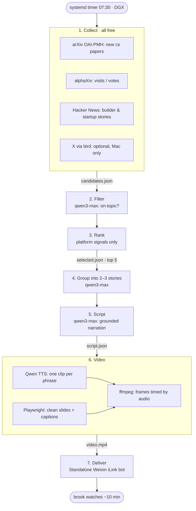

# Architecture

## Current: topic-adaptive, project-owned production

`radar run` owns the complete workload: data-only topic preset → seven-day collection and official releases → Sonnet primary-source research/selection/narration → Opus source-figure planning → measured local Piper/minimal rendering → full decode/input hashes → independent Opus actual-frame and source review → guarded standalone WeChat delivery. The supervising assistant launches/checks the job; it does not handwrite the digest. The GenUI case is `topics/genui.json`, not the engine boundary. No fixed runtime or platform quota. See [the briefing playbook](briefing-playbook.md), `radar/engine.py` and `radar/briefing_policy.py`.

DGX daily/retry timers were disabled after switching to weekly; no matching timers remain scheduled. One-off immutable DGX jobs use `deploy/run-project.sh` under detached tmux. Original-source review and final-video inspection are mandatory project-worker gates. Recurring weekly scheduling is separate; do not claim a production timer exists from a one-off launch.

## Historical daily pipeline (explicit --legacy only)

The following describes the retired daily design, not the current default or an active schedule.



| Stage | Code | What it does | Tool / AI |
|---|---|---|---|
| 1. Collect | `genui/collect.py` | Papers from last 14 days; HN last 6 days; X last 3 days | arXiv OAI-PMH (search API is blocked from DGX); alphaXiv metrics; HN Algolia API; X via `bird` (not reachable from DGX) |
| 2. Filter | `genui/rank.py` | Drop off-topic, listicles, generic news | `qwen3-max` yes/no in batches |
| 3. Rank | `genui/rank.py` | Top 5; best 1–2 from each source first; fetch linked pages | Paper `votes×10 + visits` · HN `points + 2×comments` · X `likes + 3×reposts + 2×replies` |
| 4–5. Script | `genui/script.py` | 2–3 stories, ~2,800 chars Chinese narration | `qwen3-max`; facts only from sources, guesses labelled |
| 6. Video | `genui/video.py` | Clean light slides, one message per frame, captions follow the voice | `qwen3-tts-flash`, Playwright, bundled ffmpeg |
| 7. Deliver | `genui/deliver.py`, `genui/wechat_send.py`, `genui/weixin.py` | Short message with links, then the video | Standalone iLink account, private send ledger; uncertain outcomes block replay |

## Deployment (DGX)

| What | Where |
|---|---|
| Code | `~/.local/lib/genui-daily` |
| Secret (DashScope key) | `~/.config/genui-daily/env` (600) |
| Output | `~/.local/state/genui-daily/runs/YYYY-MM-DD/` |
| Retired schedule | Former daily/retry timers are now disabled; do not reactivate them. No weekly timer deployed yet. |

The updated source uses a standalone iLink client with no Hermes imports or account-file dependencies. Pair with `python -m genui.weixin login`, confirm with `finish`, then message the bot and run `context`. Private account/context/send records live in `~/.config/genui-weixin` (directory 700, files 600). API acceptance is not proof of phone receipt. An uncertain or partially completed send is recorded and never automatically replayed.

The retired production installation is a separate snapshot and has **not** been migrated by this change. Its daily/retry timers are now disabled. Its old transport code remains until an explicit deployment replaces it; Hermes itself has now been uninstalled with brook's approval, so that installed snapshot cannot deliver until migrated. The standalone client is being tested in an isolated directory first.

## Claude generation (optional)

Qwen remains the default. To use an Anthropic-compatible gateway for relevance filtering, story writing, and scene diagram plans:

```bash
export GENUI_LLM_PROVIDER=anthropic
export GENUI_LLM_BASE_URL=http://127.0.0.1:8080  # DGX-local sub2api
export GENUI_LLM_MODEL=claude-opus-5
export GENUI_LLM_API_KEY=...                   # private env only
```

The gateway's model list on 2026-09-30 includes `claude-opus-5`, not Opus 5.5. Calls record the response model in logs and reject a different model. Qwen TTS still supplies voice; Playwright renders constrained, escaped diagram plans (flow/comparison/cards), and ffmpeg encodes the video. No model-generated JavaScript is executed. `timing.json` records measured phrase timing, subtitles, and bullet state; diagram layouts are static within each scene.

Use a separate `GENUI_RUNS` directory and `GENUI_WECHAT=0` for tests. The daily deployment is not switched by these environment examples.

## End-to-end smoke test

`python -m genui --legacy --smoke` exercises the older stages with up to eight arXiv OAI pages, top three sources, and 450–650 narration characters. Collection remains grounded: an empty relevant-source selection fails rather than inventing news. arXiv's supported OAI set is `cs` (not `cs:HC`); protocol errors can be HTTP 200, so the collector checks XML error elements.

Use a unique `GENUI_RUNS` directory. Set `GENUI_WECHAT=0` while building, then explicitly run `--legacy --from deliver` with `GENUI_WECHAT=1` for a supervised legacy send. New weekly sends use the reviewed weekly route in the playbook. `GENUI_TTS_WORKERS=1` provides a low-concurrency test. Voice progress is logged and queued synthesis requests are cancelled if a request fails.

WeChat delivery requires recent bot chat context. Ask brook to message the bot if it is stale; do not infer phone receipt from the API response or replay an unknown send outcome automatically.

## Local English narration

English is the default script language (`GENUI_LANGUAGE=en`; use `zh` for Chinese). Local voice is opt-in:

```bash
export GENUI_TTS_PROVIDER=piper
export GENUI_PIPER_PYTHON="$HOME/.local/lib/genui-local-tts/.venv/bin/python"
export GENUI_PIPER_MODEL="$HOME/.local/lib/genui-local-tts/voices/en_US-ljspeech-high.onnx"
export GENUI_TTS_WORKERS=1
```

Piper runs in a separate Python environment and subprocess; narration does not call a cloud API. Its engine is GPL-3.0; this voice's model card lists the LJ Speech dataset as public domain. Model downloads must be checksum-verified before loading (the tested voice's Git LFS SHA-256 is `5d4f08ba6a2a48c44592eed3ce56bf85e9de3dd4e20df90541ae68a8310c029a`, expected size 114,199,011 bytes). A download success log alone is not sufficient.

English captions wrap at word boundaries. Audio cache keys include the voice provider and model path so voice changes do not reuse cloud narration. These settings do not automatically modify the scheduled deployment or enable WeChat delivery.

## Topic-adaptive direction

GenUI is a preset, not the intended engine boundary. Move topic terms, source queries, audience, relevance rules, narration language/length, models, voice, branding, and delivery into configuration. Keep collection adapters, ranking mechanics, rendering, and delivery reusable. A new topic should need a new preset; a new source protocol may need a connector. This separation is planned; several modules still contain GenUI-specific constants and prompts.

## Cost

Collection sources are free. LLM calls use the configured provider and are billed normally. Weekly local Piper narration has no cloud TTS charge; the historical Qwen TTS route remains available only through explicit configuration/legacy work.
